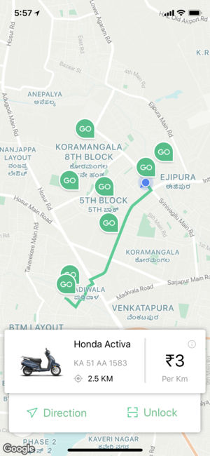
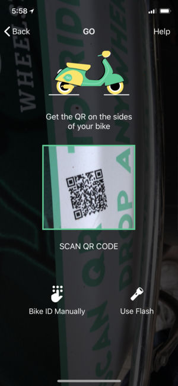
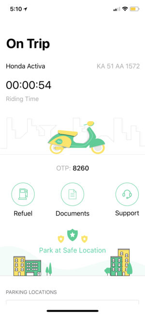

Wheelstreet GO
=================
GO by Wheelstreet is going to change the way India Commutes. One of its kind in India, Dockless scooter rentals. A Multi-feature app to make your everyday travel across the city beautifully hasslefree.

### Screenshots
<table>
  <tr>
    <td></td>
    <td></td>
    <td></td>
  </tr>
  <tr>
    <td></td>
    <td></td>
    <td></td>
  </tr>
</table>

### How it works:
- Open the app and spot any GO bike on the map.
- Scan the code on that bike to unlock the bike. 
- Take the bike anywhere, anytime.
- Now that when you have reached your destination, just open the app, click the photo of the odometer and end your trip parking the bike at any location.

### Why you will love it:
- Pick anywhere and drop anywhere
- Cheaper than a cab, auto, and even bus.
- Faster than any other transportation medium
- Your ride is just a QR code scan away

### Features:
- Smart locks to unlock the bike
- Map view to spot the nearest bike
- Approval of KYC through AI
- Fueling the bike is the easiest job for anyone 

### Installation

1. Clone the repo via git clone command.
```https://github.com/imjog/Wheelstreet-GO.git```
2. Run the following command to install all the third-party libraries.
```pod install```
3. Open in Xcode
```open Wheelstreet.xcworkspace```

**Note: This is app is officially developed for Wheelstreet Inc, Banglore. Chances are it wll not run or get crashed due to change in theirs APIs and other things.**

### Download
App is available on App Store. You can donwload on your iOS device from [here](https://itunes.apple.com/us/app/go-by-wheelstreet/id1330576017?mt=8).

### Coding standards

Followed the following guides and code standards:
[Swift Style Guide](https://github.com/linkedin/swift-style-guide)
